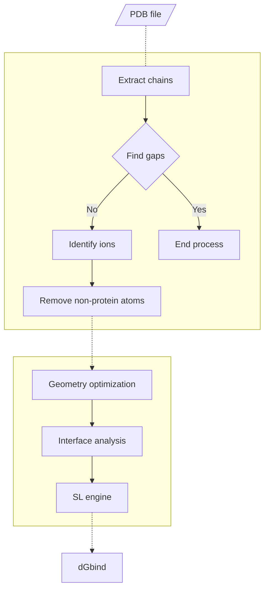

## Overview
PBEE (Protein Binding Energy Estimator) is an easy-to-use pipeline written in Python3 that use a ML model based on Rosetta descriptors (52 features) to predict the free energy of binding of protein-protein complexes.

In general, the pipeline works as follows: 
- **-\-ipdb** receives the structure of the complex(es) in pdb format;
- **-\-partner1** and **-\-partner2** receives the chain ID of the binding partners;
- run the pre- and post-processing stages and returns the free energy of binding of the complex(es) calculated by the ML model.

The PBEE workflow is shown below:



## Requirements

- RosettaCommons 3.12
- numpy 1.24.4
- pandas 2.0.3

Use `/path/to/pbee/requirements.txt` to install (or update) the numpy and pandas packages:
```
cd /path/to/pbee/folder
pip3 install -r requirements.txt
```

RosettaCommons binaries are not available in this repository and must be properly installed and configured before running PBEE. More information on downloading, installing and configuring can be found on the software's web page (https://www.rosettacommons.org/).

## Download & Install

 1. 
 2. 

## Arguments description

| Argument          | Mandatory | Description |
|-------------------|-----------|-------------|
| -\-ipdb            | Yes      | Input files in the PDB format |
| -\-partner1        | Yes      | Chain ID of the binding partner (e.g.: receptor) |
| -\-partner2        | Yes      | Chain ID of the binding partner (e.g.: ligand) |
| -\-odir            | No       | Folder path to save the output files |
| -\-ion_dist_cutoff | No       | Cutoff distance to detect ion(s) close to the protein atoms |          
| -\-force_mode      | No       | Skip warning messages and continue |

## Usage

The example below includes the structure of an antibody (HyHEL-63) that binds to lysozyme C (PDB 1XGU) with a binding affinity of -11.28 kcal/mol. In the PDB file, the heavy and light chains of the antibody (ligand) are coded as chain "A" and "B", respectively, while Lysozyme C (receptor) is coded as "C". 


```
cd /path/to/pbee/folder
pbee.py --ipdb ./test/pdbs/1xgu.pdb --partner1 AB --partner2 C --odir ./test
```
