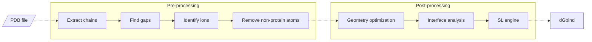

## Overview
PBEE (Protein Binding Energy Estimator) is an easy-to-use pipeline written in Python3 that use Rosetta quantites to predict the free energy of binding of protein-protein complexes. The PBEE's workflow is shown below:



## Files description

## Download

## Requirements

- RosettaCommons 3.12
- numpy 1.24.4
- pandas 2.0.3

The file `/path/to/pbee/requirements.txt` can be used to install (or update) the numpy and pandas packages using the following commands: 

```
cd /path/to/pbee/folder
pip3 install -r requirements.txt
```

## Installing

The following explains all the procedures required to install and configure the PBEE pipeline.

 1. List item
 2. ...

## Usage
| Argument          | Mandatory | Description |
|-------------------|-----------|-------------|
| -\-ipdb            | Yes      |             |
| -\-partner1        | Yes      |             |
| -\-partner2        | Yes      |             |
| -\-odir            | No       |             |
| -\-ion_dist_cutoff | No       |             |
| -\-force_mode      | No       |             |
