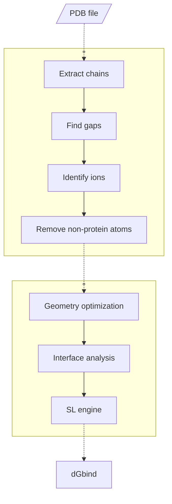

## Overview
PBEE (Protein Binding Energy Estimator) is an easy-to-use pipeline written in Python3 that use a ML model based on Rosetta descriptors (52 features) to predict the free energy of binding of protein-protein complexes. The PBEE workflow is shown below. 

In general, the pipeline works as follows: (i) the argument --ipdb receives the structure of the complex(es) in pdb format; (ii) the arguments --partner1 and --partner2 receives the chain ID of the binding partners; and (iii)  run the pre- and post-processing stages and returns the free energy of binding of the complex(es) (in kcal/mol) calculated by the super learner model. The PBEE starts pre-processing by checking that the chain IDs are actually included in the PDB file and then looks for gaps in the backbone.



## Requirements

- RosettaCommons 3.12
- numpy 1.24.4
- pandas 2.0.3

Use `/path/to/pbee/requirements.txt` to install (or update) the numpy and pandas packages:
```
cd /path/to/pbee/folder
pip3 install -r requirements.txt
```

RosettaCommons is not available in this repository and must be properly installed and configured to run PBEE. More information on downloading, installing and configuring can be found on the software's web page

## Download & Install

 1. List item
 2. ...

## Arguments description

| Argument          | Mandatory | Description |
|-------------------|-----------|-------------|
| -\-ipdb            | Yes      | Input files in the PDB format |
| -\-partner1        | Yes      | Chain ID of the binding partner (e.g.: receptor) |
| -\-partner2        | Yes      | Chain ID of the binding partner (e.g.: ligand) |
| -\-odir            | No       | Folder path to save the output files |
| -\-ion_dist_cutoff | No       | Cutoff distance to detect ion(s) close to the protein atoms |          
| -\-force_mode      | No       | Skip warning messages and continue |
